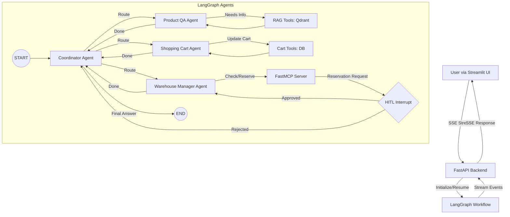

# 🏢 Enterprise Agent Platform

[](https://www.python.org/)
[](LICENSE)
[](https://langchain-ai.github.io/langgraph/)
[](https://fastapi.tiangolo.com/)

The Enterprise Agent Platform is designed to handle complex e-commerce workflows autonomously while maintaining strict control over critical actions. Instead of a monolithic LLM call, the system uses a Coordinator Agent to delegate tasks to specialized sub-agents:

- Product QA Agent: Uses Agentic RAG (via Qdrant) to answer detailed product questions and fetch reviews.
- Shopping Cart Agent: Manages user cart state (add, remove, view items).
- Warehouse Manager Agent: Communicates via MCP to check inventory across multiple warehouses and handle reservations.

Critical operations, such as reserving warehouse inventory, trigger a Human-In-The-Loop (HITL) interrupt, pausing the graph until a human operator approves or rejects the action via the Streamlit UI.

---

## Key Features

- Multi-Agent Orchestration: Stateful routing and execution using LangGraph.
- Model Context Protocol (MCP): Decoupled tool execution for warehouse management (availability checks and transactional reservations).
- Agentic RAG: Context-aware product recommendations and QA powered by Qdrant vector database.
- Human-In-The-Loop (HITL): Mandatory human approval for sensitive actions like inventory reservation.
- Streaming UI: Real-time Server-Sent Events (SSE) for transparent agent "thinking" and tool-calling processes.
- Persistent State: PostgreSQL-backed LangGraph checkpointing ensures conversation and cart state survive restarts.
- Feedback Loop: Built-in thumbs-up/down feedback system tied to trace IDs for continuous LLM evaluation.

## Architecture


## Getting Started
**Prerequisites**
- Python 3.13+
- uv (Fast Python package installer and resolver)
- Docker & Docker Compose

### 1. Clone the Repository
```bash
git clone https://github.com/0xAgamy/enterprise_agent_platform.git
cd enterprise_agent_platform
```


### 2. Configure Environment Variables
Copy the example environment files and fill in your credentials (e.g., LLM API keys, database URLs):
```bash
cp .env.example .env
cp .env.postgres.example .env.postgres
```
Edit `.env` and `.env.postgres` with your preferred text editor.

### 3. Install Dependencies & Start Services
The included `Makefile` provides a streamlined setup process that syncs Python dependencies and spins up the required Docker containers (PostgreSQL and Qdrant):
```bash
make run-docker-compose
```

### 4. Access the Application
- FastAPI Docs: `http://localhost:8000/docs` (or the port specified in your .env)
- Streamlit Frontend: `http://localhost:8501` (or the port specified in your setup)


<div align="center">
Built with ❤️ by <a href="https://github.com/0xAgamy">Mohamed Elagamy</a>
</div>